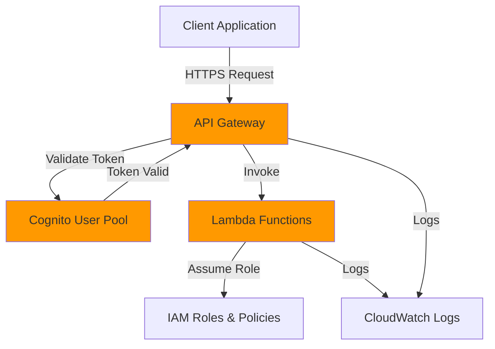
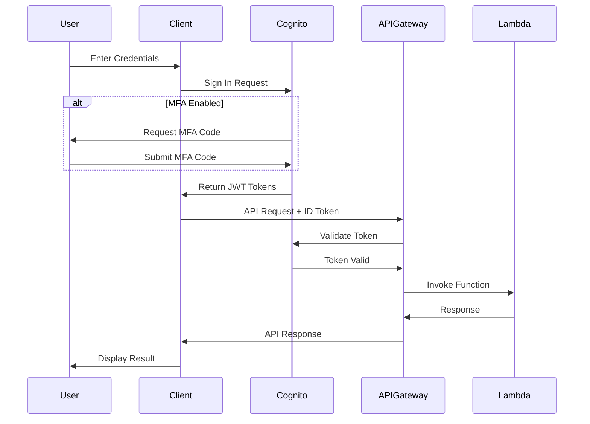

# User Gateway

A production-ready identity and access management infrastructure built with Terraform, featuring AWS Cognito for authentication and API Gateway for secure API access control.

## Project Overview

- Multi-Factor Authentication (MFA)
- JWT Token Validation
- Secure API Access with API Gateway
- User Pool Management with AWS Cognito
- OAuth 2.0 / OIDC Support
- Role-Based Access Control (RBAC)
- Infrastructure as Code with Terraform
- Multi-environment support (dev/staging/prod)
- Cloud-agnostic design patterns

## Architecture

### System Architecture



### Authentication Flow



### Key Components

1. **AWS Cognito User Pool**: Manages user registration, authentication, and MFA
2. **API Gateway**: Provides secure REST API endpoints with Cognito authorizers
3. **Lambda Functions**: Backend logic for protected resources
4. **IAM Roles & Policies**: Least-privilege access control

## Quick Start

### Prerequisites

- Terraform >= 1.0
- AWS CLI configured with appropriate credentials
- An AWS account with necessary permissions

### Installation

```bash
# Initialize Terraform
cd environments/dev
terraform init

# Review the plan
terraform plan

# Apply the infrastructure
terraform apply
```

### Configuration

1. Copy `terraform.tfvars.example` to `terraform.tfvars`
2. Update variables with your specific values
3. Ensure AWS credentials are configured

```bash
export AWS_PROFILE=profile
export AWS_REGION=us-east-1
```

## Post-Deploy Verification

Use these commands to confirm that Cognito and API Gateway were deployed correctly and are healthy.

### Discover IDs and ARNs

```bash
# Get Cognito User Pools in the region
aws cognito-idp list-user-pools --max-results 60

# Describe a User Pool (replace with your pool ID)
aws cognito-idp describe-user-pool --user-pool-id <USER_POOL_ID>

# List User Pool clients
aws cognito-idp list-user-pool-clients --user-pool-id <USER_POOL_ID> --max-results 60

# Get API Gateway REST APIs
aws apigateway get-rest-apis

# Get stages for the API (replace with your REST API ID)
aws apigateway get-stages --rest-api-id <REST_API_ID>
```

### Verify Cognito configuration

```bash
# Check MFA configuration
aws cognito-idp describe-user-pool --user-pool-id <USER_POOL_ID> \
  --query 'UserPool.MfaConfiguration'

# Check advanced security
aws cognito-idp describe-user-pool --user-pool-id <USER_POOL_ID> \
  --query 'UserPool.UserPoolAddOns'

# Verify domain (if configured)
aws cognito-idp describe-user-pool --user-pool-id <USER_POOL_ID> \
  --query 'UserPool.Domain'

# Try sign-up and auth (replace values)
aws cognito-idp sign-up \
  --client-id <CLIENT_ID> \
  --username user@example.com \
  --password "SecureP@ssw0rd!" \
  --user-attributes Name=email,Value=user@example.com

aws cognito-idp initiate-auth \
  --client-id <CLIENT_ID> \
  --auth-flow USER_PASSWORD_AUTH \
  --auth-parameters USERNAME=user@example.com,PASSWORD="SecureP@ssw0rd!"
```

### Verify API Gateway deployment and stage

```bash
# Confirm the deployment and stage exist
aws apigateway get-stages --rest-api-id <REST_API_ID>

# Get the API's base URL for the stage
API_ID=<REST_API_ID>
REGION=<REGION>
STAGE=<ENVIRONMENT_STAGE> # e.g., dev
BASE_URL="https://${API_ID}.execute-api.${REGION}.amazonaws.com/${STAGE}"
echo "$BASE_URL"

# Test public health endpoint (MOCK integration)
curl -s "${BASE_URL}/health" | jq .

# Test protected profile endpoint (requires Cognito token)
# Replace <ID_TOKEN> with the token from initiate-auth
curl -s -H "Authorization: Bearer <ID_TOKEN>" "${BASE_URL}/profile" | jq .
```

### Check CloudWatch logs

```bash
# API Gateway access logs
aws logs describe-log-groups \
  --log-group-name-prefix "/aws/apigateway/"

# Lambda logs (replace function name if needed)
aws logs describe-log-groups \
  --log-group-name-prefix "/aws/lambda/"

# Tail recent API Gateway logs (replace log group name)
aws logs filter-log-events \
  --log-group-name "/aws/apigateway/<PROJECT>-<ENV>" \
  --limit 50
```

## Is the API deployed automatically?

Yes. The Terraform `api-gateway` module creates:
- `aws_api_gateway_deployment` to publish changes
- `aws_api_gateway_stage` named after your environment (e.g., `dev`)

After `terraform apply`, your API is live at:
`https://<API_ID>.execute-api.<REGION>.amazonaws.com/<STAGE>`

## Environment Workflow Guidance

For a solo developer, a pragmatic workflow is:
- Use two environments: `dev` and `prod`.
- `dev`: fast iteration, no remote backend, state local. Validate changes end-to-end.
- `prod`: remote backend (S3 + DynamoDB lock), change control, versioned artifacts.

Recommended practices:
- Keep `dev` as your integration test bed. Do not destroy on every change; reuse to catch regressions.
- Only destroy `dev` when you need a clean slate or to reduce costs. Prefer `terraform destroy` within the targeted environment directory.
- Promote changes to `prod` with:
  - Remote backend enabled
  - Variables tuned for production (throttling, MFA strictly enforced, tags)
  - Least-privilege IAM reviewed

Common failure points when switching to prod:
- Backend/state migration mistakes (ensure S3 bucket and DynamoDB lock exist and are referenced correctly)
- Missing environment-specific variables (e.g., different domains, stricter password/MFA)
- IAM permission gaps (Lambda role policies insufficient for prod data sources)
- API Gateway throttling too strict for real traffic
- Cognito hosted domain conflicts (domain name must be globally unique)

## Suggested Environment Workflow

```bash
# DEV (local state)
cd environments/dev
terraform init
terraform plan
terraform apply

# Optional: clean dev
terraform destroy

# PROD (remote backend recommended)
cd environments/prod

# Example backend block (uncomment and configure in root module)
# backend "s3" {
#   bucket         = "<STATE_BUCKET>"
#   key            = "user-gateway/terraform.tfstate"
#   region         = "us-east-1"
#   encrypt        = true
#   dynamodb_table = "terraform-state-lock"
# }

terraform init -reconfigure
terraform plan -var-file=terraform.tfvars
terraform apply -var-file=terraform.tfvars
```

##  Project Structure

```
user-gateway/
├── modules/
│   ├── cognito/              # Cognito User Pool & Client configuration
│   ├── api-gateway/          # API Gateway with Cognito authorizer
│   ├── lambda/               # Lambda functions for API backend
│   └── iam/                  # IAM roles and policies
├── environments/
│   ├── dev/                  # Development environment
│   ├── staging/              # Staging environment
│   └── prod/                 # Production environment
├── scripts/                  # Utility scripts for testing/deployment
├── .gitignore
├── .terraform-version
├── AGENTS.md                 # Development guide
└── README.md                 # This file
```

##  Security Features

### Multi-Factor Authentication (MFA)
- SMS-based MFA
- TOTP (Time-based One-Time Password) support
- Configurable MFA requirements per user pool

### Token Validation
- JWT token verification
- Token expiration handling
- Refresh token rotation
- Secure token storage patterns

### API Security
- Cognito authorizers on all protected endpoints
- Request validation
- Rate limiting and throttling
- CORS configuration
- API key management (optional)

### Compliance & Best Practices
- Encryption at rest and in transit
- Password policies (complexity, rotation)
- Account recovery mechanisms
- Audit logging with CloudWatch
- Secrets management (AWS Secrets Manager integration ready)

##  Attack Surface Protection

This implementation protects against common attack vectors:

- **Brute Force Attacks**: Rate limiting, account lockout policies
- **Credential Stuffing**: MFA enforcement, advanced security features
- **Token Theft**: Short-lived tokens, token rotation
- **CSRF**: Token-based authentication
- **SQL Injection**: Parameterized queries in Lambda functions
- **DDoS**: API Gateway throttling, WAF integration ready

##  Module Documentation

### Cognito Module
Creates and configures AWS Cognito User Pool with:
- User attributes schema
- Password policies
- MFA configuration
- Lambda triggers (pre-signup, post-confirmation, etc.)
- Domain configuration for hosted UI

### API Gateway Module
Deploys REST API with:
- Cognito authorizer integration
- CORS configuration
- Request/response models
- Deployment stages
- CloudWatch logging

### Lambda Module
Provisions Lambda functions for:
- User profile management
- Protected resource access
- Custom authentication flows
- Post-authentication processing

### IAM Module
Defines least-privilege policies for:
- Lambda execution roles
- API Gateway invoke permissions
- Cognito service permissions

### Migration Considerations

To adapt this to other cloud providers:
- **Azure**: Replace Cognito → Azure AD B2C, API Gateway → Azure API Management
- **GCP**: Replace Cognito → Firebase Auth/Identity Platform, API Gateway → Cloud Endpoints
- **Multi-cloud**: Abstract authentication with standards-based approach

##  Usage Examples

### User Registration

```bash
# Register a new user
aws cognito-idp sign-up \
  --client-id <CLIENT_ID> \
  --username user@example.com \
  --password "SecureP@ssw0rd!" \
  --user-attributes Name=email,Value=user@example.com
```

### User Authentication

```bash
# Authenticate and receive tokens
aws cognito-idp initiate-auth \
  --client-id <CLIENT_ID> \
  --auth-flow USER_PASSWORD_AUTH \
  --auth-parameters USERNAME=user@example.com,PASSWORD="SecureP@ssw0rd!"
```

### API Access

```bash
# Call protected API endpoint
curl -H "Authorization: Bearer <ID_TOKEN>" \
  https://<API_ID>.execute-api.<REGION>.amazonaws.com/dev/profile
```

##  Testing

```bash
# Run validation tests
cd scripts
./test-authentication.sh

# Test MFA flow
./test-mfa.sh

# Load testing
./load-test.sh
```

##  Monitoring & Logging

- CloudWatch Logs for Lambda functions
- API Gateway access logs
- Cognito user pool analytics
- Custom metrics for authentication events
- Alarms for security events

## Resources

- [AWS Cognito Documentation](https://docs.aws.amazon.com/cognito/)
- [API Gateway Authorizers](https://docs.aws.amazon.com/apigateway/latest/developerguide/apigateway-use-lambda-authorizer.html)
- [Terraform AWS Provider](https://registry.terraform.io/providers/hashicorp/aws/latest/docs)
- [OAuth 2.0 & OIDC Specifications](https://oauth.net/2/)
